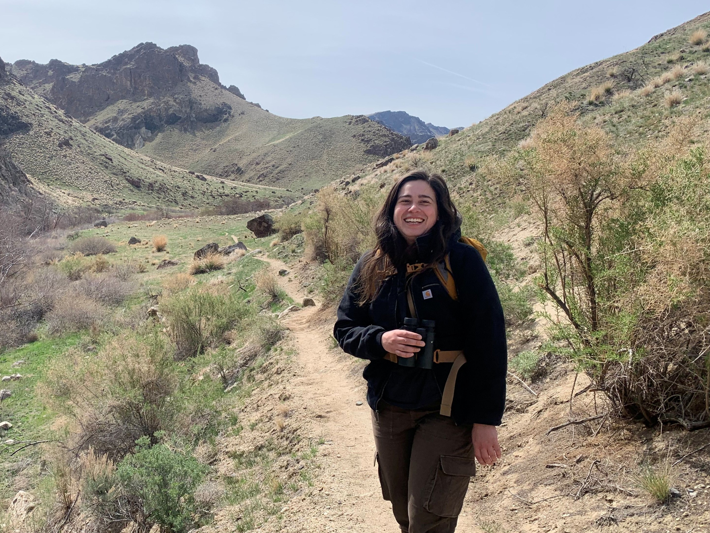

<!-- Full-viewport hero with text overlay -->

  
  

  

    
Ecology, Evolution, & Behavior PhD Student · Boise State University · Raptor Research Center

    <h1 style="font-family: 'Playfair Display', serif; font-size: 4.5rem; color: #f7f3ee; margin: 0 0 1rem; line-height: 1.05; text-shadow: 0 2px 20px rgba(0,0,0,0.3);">Ashley Santiago</h1>
  

<!-- Bio strip — full width, two columns -->

  

    

           I am currently studying Golden Eagle ecology, survival, and population dynamics, combining field ecology with 
      statistical modeling and novel genomic approaches to understand the potential drivers of population decline and inform 
      conservation strategies. I work in the <a href="https://www.heathlab.com" target="_blank">Heath Lab</a> at Boise State University.
    

  

  

    
  

<!-- Research section — dark background, full width -->

  

    <h2 style="font-size: 2rem; color: #f0f4ec; margin: 0; line-height: 1.2;">Research</h2>
    

      My work integrates long-term field data, statistical modeling, and genomics to understand raptor population dynamics and inform conservation management.
    

  

  

    <!-- Territory Occupancy -->
    <a href="research-occupancy" style="text-decoration: none; display: flex; flex-direction: column; align-items: center; gap: 1.2rem;">
      

        
      

      

        
Territory Ecology

        
Territory Occupancy

      

    </a>

    <!-- First-year Survival -->
    <a href="research-survival" style="text-decoration: none; display: flex; flex-direction: column; align-items: center; gap: 1.2rem;">
      

        
      

      

        
Survival Analysis

        
First-year Survival

      

    </a>

    <!-- Adult Turnover -->
    <a href="research-turnover" style="text-decoration: none; display: flex; flex-direction: column; align-items: center; gap: 1.2rem;">
      

        
      

      

        
Population Genomics

        
Adult Turnover

      

    </a>

  

  

    <a href="research" style="display: inline-block; border: 1.5px solid rgba(220,235,210,0.4); color: rgba(220,235,210,0.85); padding: 0.65rem 2rem; border-radius: 3px; font-family: 'Lora', serif; font-size: 0.88rem; letter-spacing: 0.08em; text-transform: uppercase; transition: all 0.2s;"
       onmouseover="this.style.borderColor='#85a870'; this.style.color='#c8dabb'"
       onmouseout="this.style.borderColor='rgba(220,235,210,0.4)'; this.style.color='rgba(220,235,210,0.85)'">View All Research →</a>
  

